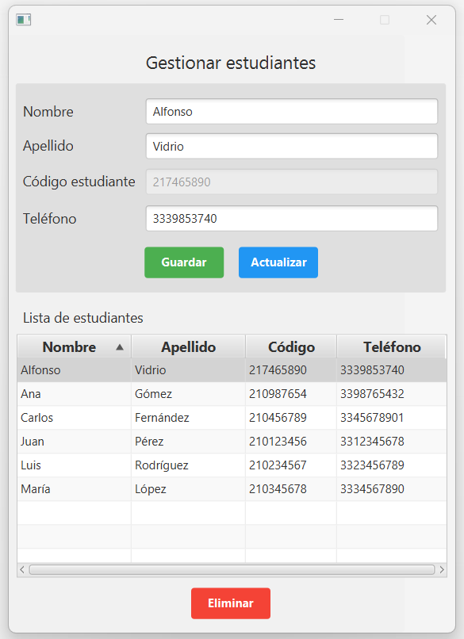

# Student CRUD Application in JavaFX

This project is a student CRUD application using JavaFX, which allows you to manage data such as name, student code, last name, and phone number. The interface is intuitive and styled with a bit of CSS. It is implemented following the MVC pattern, facilitating code organization.

## Features

- Manage student data (name, student code, last name, phone number).
- Intuitive graphical interface.
- Customized styling with CSS.
- MVC pattern implementation.

## Technologies Used

- Java
- JavaFX
- Scene Builder
- CSS

## Usage

The application allows you to easily perform create, read, update, and delete operations on student data.

## Application Screenshot

